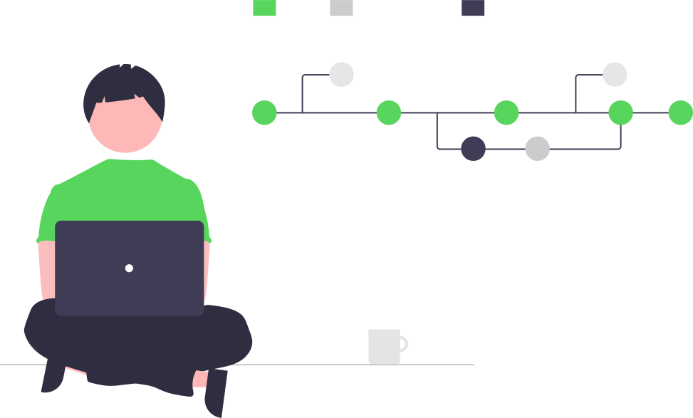

### Hi friends!

I am a student of programming, curious and passionate about the idea of ​​being able to achieve so many incredible results using the best technologies. 💻 I'm always looking to evolve, learn something new and be better than I was yesterday.

- 📚 I’m currently learning about JavaScript Universe;
- 👷🏽‍♂️ I am dedicating to fullStack development with NodeJS, React and React native. But, the current focus is on ReactJs;
   

  
   
  

    
   
   
  

  
  #### 📢 Contact me: 
  

    
    
  

#### ⚙️ Languages and Tools

  
  
  
  
  
  
  

