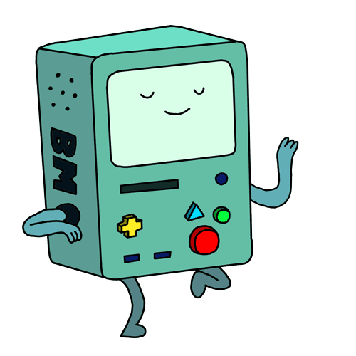

# Olá, me chamo Bruno 

Engenheiro de Software com sólida experiência em desenvolvimento de aplicações FullStack WEB e MOBILE modernas. Foco em evolução arquitetural, escalabilidade e alto desempenho.

## 👨‍💻 Sobre mim

- 🎯 **Roadmap Sênior**: Consolidando expertise em decisões de arquitetura e liderança técnica para sustentar produtos de alta complexidade.
- 💻 **Qualidade e Padrões**: Defensor de boas práticas e decisões pragmáticas de arquitetura. Acredito que um bom _produto de software_ nasce do equilíbrio entre **qualidade técnica e resultado**.

- 🇺🇸 **Global Path**: Estudante ativo de inglês, buscando fluência para colaboração em projetos internacionais.

---

## 🚀 Tech Stack & Ferramentas

| 📱 Frontend & Mobile | ⚙️ Backend | ☁️ DevOps & Deploy |
| :--- | :--- | :--- |
|  |  |  |
|  |  |  |
|  |  |  |
|  |  |  |
|  |  |  |
|  | | |

---

## 📊 Minhas Estatísticas

---

## 📫 Entre em contato

